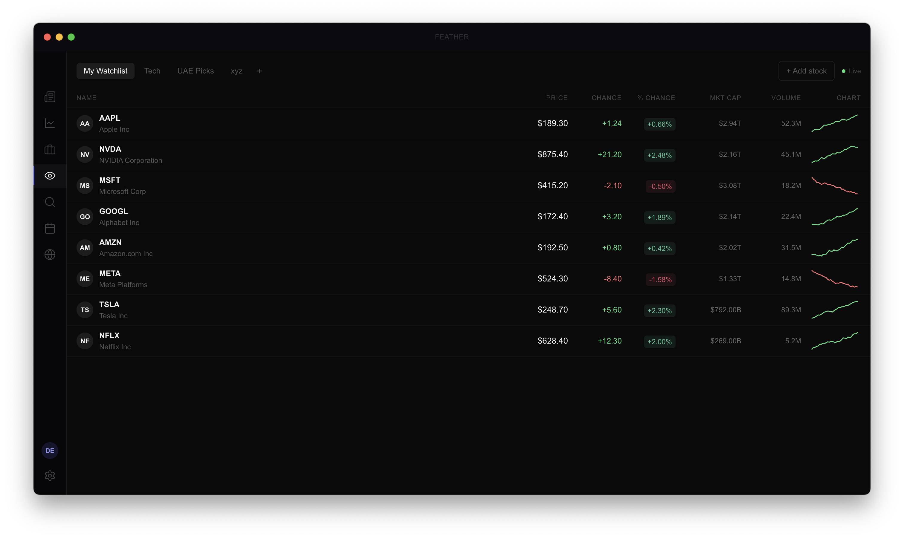
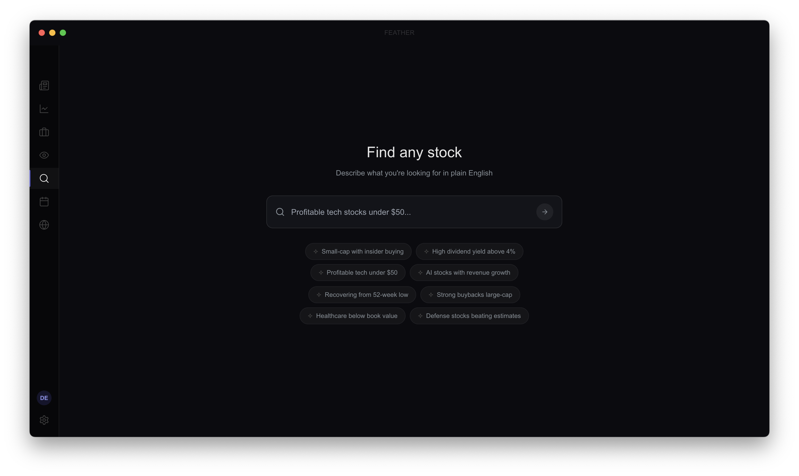
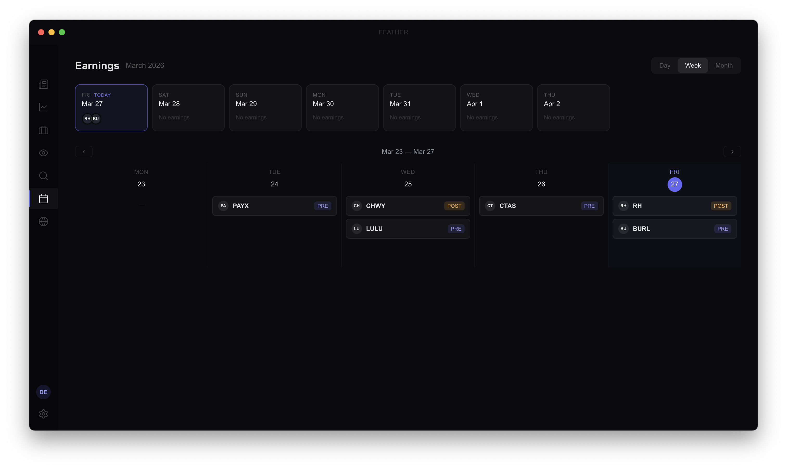
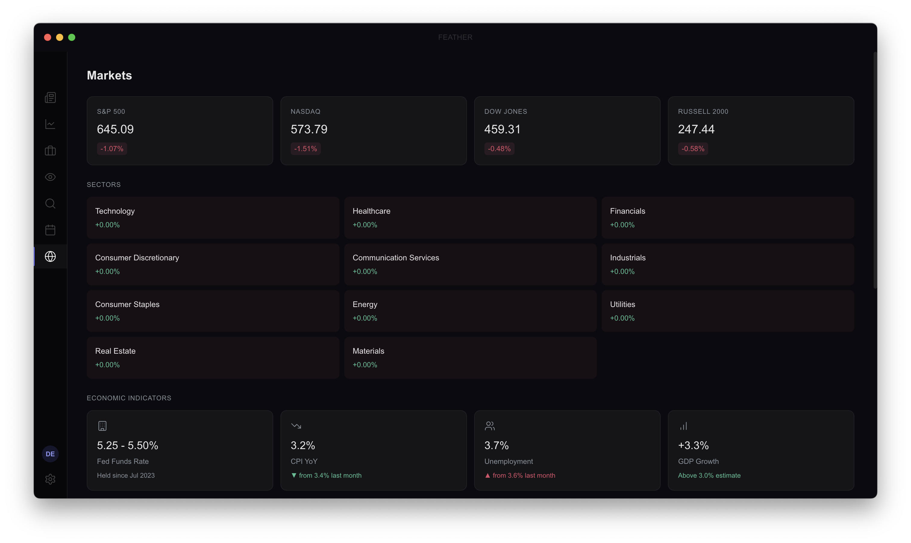
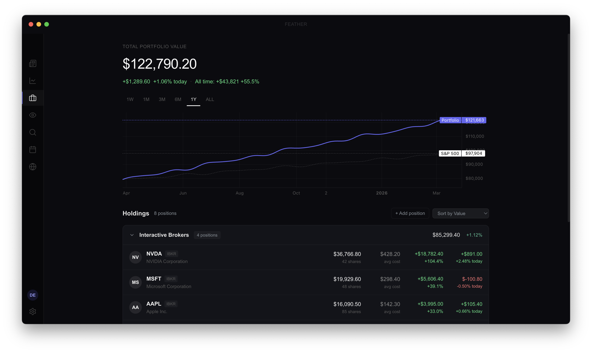

# Feather

Premium US equity research desktop app. Electron + React + TypeScript.


## Quick Start

```bash
git clone <repo-url>
nvm use                  # Auto-picks Node 20
npm install
cp .env.example .env     # Then replace your keys in .env
npm run dev              # Done — opens at http://localhost:5173
```

You'll see a mock sign-in screen — click "Sign in" to enter. Use `npm run dev:electron` instead for the Electron desktop window.

### Running the backend (optional)

The Express server is only needed for AI features and protected API routes:

```bash
# In a separate terminal:
npm run server           # Starts on http://localhost:3001
```

## Prerequisites

- **Node.js 20+** (`.nvmrc` included — run `nvm use` if you use nvm)
- **macOS** (Electron builds target Mac; the browser dev mode works anywhere)

## API Keys

**Everything is optional.** The app runs entirely on mock data with zero API keys. Add keys to `.env` to progressively enable real data:

| Key | What it enables | Without it |
|-----|----------------|------------|
| `VITE_POLYGON_API_KEY` | Live quotes, real stock data, news, market indices | Mock prices & data everywhere |
| `ANTHROPIC_API_KEY` | AI screener, morning brief, stock analysis | Fuzzy mock matching, placeholder briefs |
| `VITE_CLERK_PUBLISHABLE_KEY` + `CLERK_SECRET_KEY` | Google OAuth login | Mock "Sign in" button (auto-authenticates) |
| `STRIPE_SECRET_KEY` + price IDs | Checkout, subscription management | Mock user is auto-subscribed |
| `PLAID_CLIENT_ID` + `PLAID_SECRET` | Real broker account connections | Demo & paper trading portfolios only |

Get a free Polygon.io key at [polygon.io](https://polygon.io) — that alone makes the app feel real.

## Scripts

| Command | Description |
|---------|-------------|
| `npm run dev` | Vite dev server (browser at localhost:5173) |
| `npm run dev:electron` | Vite + Electron desktop window |
| `npm run server` | Express backend (localhost:3001) |
| `npm run typecheck` | TypeScript strict check |
| `npm run build` | Production build |
| `npm run build:electron` | Build .dmg installer |
| `npm run lint` | ESLint |

## Screens

| Screen | Description |
|--------|-------------|
| **Morning Brief** | Daily market summary, AI-generated recap, news feed with sentiment |
| **Stock Research** | Price chart, key stats, financials, analyst estimates, news panel |
| **Watchlist** | Multi-list tabs, live WebSocket quotes, sparklines |
| **Portfolio** | Demo, paper trading, and real broker portfolios |
| **Screener** | Natural language stock search ("profitable tech under $50") |
| **Earnings** | Calendar grid, upcoming strip, beat/miss indicators |
| **Markets** | Indices, sector heatmap, economic indicators & calendar |
| **Settings** | Account, billing, subscription, preferences |

Global: **Cmd+K** opens the command bar (search any stock or navigate screens).

<details>
<summary>Screenshots</summary>

| | |
|---|---|
|  |  |
|  |  |
|  |  |

</details>

## Architecture

```
feather/
├── electron/              # Main process, menu, preload
├── server/                # Express API (tsx)
│   ├── routes/            # ai, analysis, market, subscriptions, portfolio, watchlist
│   ├── middleware/         # auth (Clerk), rate limiting
│   └── lib/               # stripe helpers
├── src/
│   ├── layout/            # AppShell, Sidebar, TitleBar, CommandBar
│   ├── components/        # AuthGate, ErrorBoundary, WelcomeScreen, SearchModal
│   ├── design-system/     # Tokens, Badge, Button, Card, Skeleton, Sparkline, etc.
│   ├── screens/           # 8 screens (see above), each with sub-components
│   ├── hooks/             # All data fetching (usePolygon, useStockData, useNews, etc.)
│   ├── store/             # Zustand: user, watchlist, portfolio, research, ui
│   ├── lib/               # API clients (polygon, stripe, claude, plaid)
│   ├── types/             # TypeScript interfaces
│   └── mocks/             # Mock data for every screen
├── design-reference/      # Fey.com visual reference frames
└── screenshots/           # App screenshots
```

**Key patterns:**
- Components never call APIs directly — always through hooks in `src/hooks/`
- All colors from `src/design-system/tokens.ts` (never hardcode hex)
- Zustand for all global state (no localStorage/sessionStorage directly)
- Every screen has: loading skeleton → error state → empty state → data state
- Mock data in `src/mocks/` used when API keys aren't set

## Tech Stack

| Layer | Tech |
|-------|------|
| Shell | Electron 28 |
| Frontend | React 18, TypeScript (strict), Vite 6 |
| Styling | Tailwind CSS |
| Animation | Framer Motion |
| Charts | TradingView Lightweight Charts |
| State | Zustand |
| Auth | Clerk (Google OAuth) |
| Billing | Stripe |
| Market Data | Polygon.io (REST + WebSocket) |
| AI | Claude API (server-proxied) |
| Broker Sync | Plaid |

## Working with Claude Code

This repo includes a `CLAUDE.md` with coding conventions and a `CONTEXT.md` with full architecture context. If you use [Claude Code](https://claude.com/claude-code), it will automatically read these and understand the project structure, design tokens, and patterns.

Useful starting prompts:
- "Explain how the watchlist screen works end to end"
- "What happens when a user signs in for the first time?"
- "How does live quote data flow from Polygon to the UI?"

## Project Files

| File | Purpose |
|------|---------|
| `CLAUDE.md` | Coding conventions, rules, design tokens reference |
| `CONTEXT.md` | Full architecture context, project structure, known issues |
| `SPRINTS.md` | 10-day sprint plan with completion status |
| `TODO.md` | Current task backlog |
| `.env.example` | All environment variables with descriptions |
